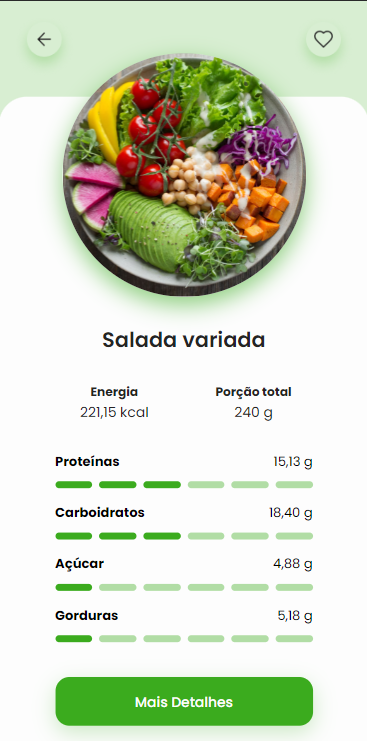

<h1 align="center"> Tabela Nutricional </h1>

Projeto para mobile front-end baseado nos desafios disponibilizados pela rocketseat no Figma 

 

  

## 🚀 Tecnologias

Esse projeto foi desenvolvido com as seguintes tecnologias:

- HTML e CSS
- JavaScript
- Git e Github
- Figma

## 💻 Projeto

O Jogo da forca foi desenvolvido nas aulas da AdaTech, com foco em aprender melhor os funcionamentos do CANVA no HTML, e aprimorar as habilidades JavaScript com criatividade

- [Visualize o figma do projeto](https://www.figma.com/community/file/1281253271689247675/tabela-nutricional-desafio-36)

## Créditos

Feito por Dário Klein ♥ 
